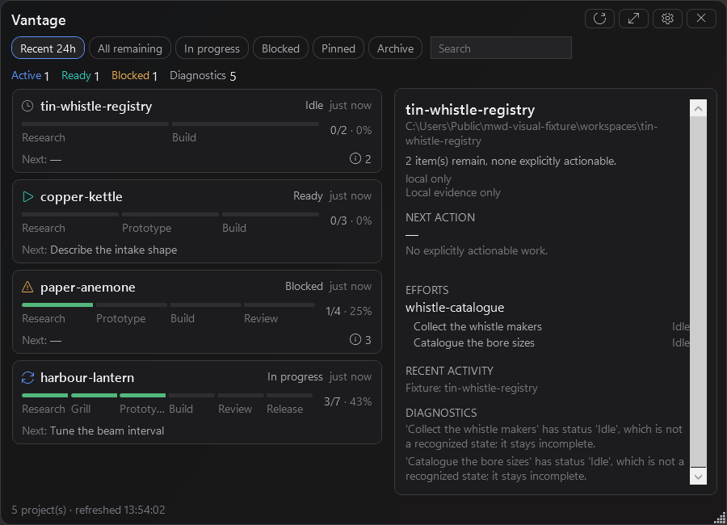
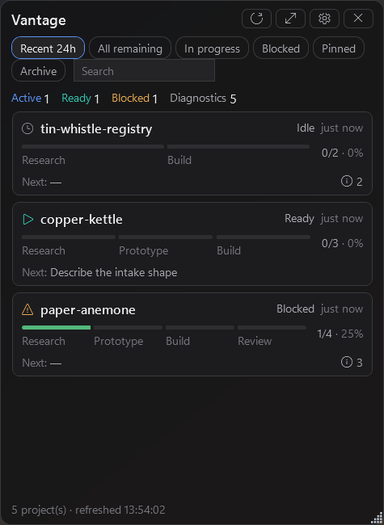

# Vantage

Work spread across a dozen repositories leaves a trail — planning files, commits, branches, issues.
Vantage reads that trail and reconstructs what each project is actually doing, without ever writing
to any of it, and shows you where every conclusion came from.

**Status: personal alpha.** Built for one person's workflow on one machine, and published as a
working reference implementation rather than a product. Windows 11 x64 only.

> Source-available for review and evaluation. **This is not open-source software** — see
> [NOTICE.md](NOTICE.md).



<sub>Rendered from a synthetic fixture by the application's own <code>--capture</code>
instrumentation. Every project, path and ticket in the frame is invented.</sub>

---

## The problem

If you work across many repositories at once, the state of that work lives in your head. Which
project is blocked and on what. Which one you left mid-thought three days ago. Which ticket is
actually next rather than merely open. The evidence to answer all of it already exists on disk — it
is just scattered across markdown files, Git history, and issue trackers, in shapes that do not
compose.

The usual fix is to adopt a tool that becomes the authority: you move the work into it, and now the
tool's model of your project is the real one, and keeping it true is another job.

Vantage takes the opposite position. It is strictly an observer. It writes nothing, owns nothing,
and holds no state you would miss — delete everything it has ever written and you lose some speed
and some history, and nothing else. If it disagrees with your repository, your repository is right
and Vantage has a bug.

## What it does

It discovers projects beneath the roots you configure, indexes their `.scratch` planning artifacts
and reachable local Git history, and projects that evidence into project states, next actions,
recent activity, diagnostics, and progress across the whole pipeline — planning, research,
grilling, prototypes, implementation, review, and release.

Optionally, it enriches projects you have explicitly linked to a GitHub repository through your
already-authenticated `gh` session, and reports where local and remote evidence disagree.

**v1 ships local-only.** GitHub enrichment is built, specified and tested, but off by default and
outside v1's acceptance surface — [issue #8](https://github.com/Leit-motif/vantage/issues/8) is the
complete record of what it adds and what resuming it involves. Anything below that mentions GitHub
describes behaviour you get after turning on `GitHubEnrichmentEnabled` in Settings, not what a
default install does.

## The rule it is built on

Most of the interesting engineering here is one constraint: **an observation and a conclusion are
different kinds of thing, and the difference has to survive all the way to the screen.**

Evidence moves through three stages, and never backwards:

```
Observed          exactly what a source said, as it was written
    |             ObservedArtifact · ObservedCommit · ObservedGitHubIssue
    v
Normalized        the workflow facts those observations imply
    |             WorkflowEffort · WorkflowTicket · WorkflowStatus
    v
Projected         what the dashboard is prepared to tell you
                  project state · next action · progress · conflicts
```

Every fact carries a `Provenance` from the moment it is observed: which adapter saw it, the locator
it was seen at, the raw value as written, and — the part that matters most — **what kind of
timestamp it has**.

That last one is the difference between a dashboard you can trust and one you cannot. A file's
modification time is not evidence that work happened; it is evidence that a file changed. So
timestamps are typed rather than merged into one number:

| `TimestampProvenance` | What it actually means |
| --- | --- |
| `GitCommit` | An author committed at this time |
| `GitHubApi` | A remote system recorded this time |
| `WatcherEvent` | The filesystem told us while we were watching |
| `ObservedChange` | We compared two refreshes and saw real movement — but this is when we *noticed*, not when it happened |
| `FileSystem` | A modification time, and nothing more |

`ObservedChange` exists because the honest answer to "when did this change?" on a first scan is
usually "we don't know — only that it differs from last time." Collapsing that into a real timestamp
would have been easy, and would have quietly made the entire display untrustworthy.

### When sources disagree

Local files are primary. GitHub fills gaps and supplies remote activity; it never overrules what is
on disk. Identity comes only from explicit links — title similarity is never an identity signal, so
two similarly named pieces of work are never silently merged into one.

When the two sides genuinely disagree, that is surfaced rather than resolved away. A project's
conflict badge is a control rather than a decoration: it opens that project's disagreements, each
one naming the item, what the local side says, what the remote side says, which side was kept and
why, and where each side was observed — down to the refresh that produced it.

### Association, not identity

A GitHub origin is an association on a local path, never the project's identity. The first remote
seen is recorded. If the remote later changes, the new one is held as *pending* and reported, and
Vantage keeps using the confirmed association until you confirm the relink — which adopts the
pending origin **you were shown**, not whatever the remote happens to read by the time you click.

## What it never does

- Change a workflow file, Git state, a GitHub issue or label, or repository configuration.
- Enumerate your GitHub account. Only repositories associated with a local project are queried.
- Execute anything it reads. Monitored content is data; external commands receive structured
  argument lists and never a shell string.
- Send telemetry, analytics, or crash reports anywhere.
- Write its own state into a repository it is watching.

The first and last of those are not claims. They are [measured on every acceptance
run](docs/acceptance/README.md) against real workspaces, by fingerprinting the tree before and
after.

## Discovery

A project is any directory carrying `.git`, `AGENTS.md`, `docs/agents/issue-tracker.md`, or
`.scratch`. Nesting changes nothing on its own — a project inside another project is discovered like
any other.

Vendor, dependency, build and cache trees are the exception. `node_modules`, `obj`, `.venv`,
`packages` and the rest of a configurable list are never walked into uninvited, so if you keep a
genuinely independent project down there, name its full path under **Settings → Projects** to opt it
in.

Registry intent is per project and written the moment it is made. Enabled, hidden or excluded;
pinned; nested opt-in — all survive a restart. Hiding a project keeps its entry rather than
forgetting it, so the choice is not silently undone by the next scan.

Discovery is bounded, and the bounds are configurable and reported: maximum depth, maximum projects,
maximum directories scanned, concurrent external processes, per-process timeout. A scan that hits a
bound says so in diagnostics rather than returning a quietly short answer.

## Architecture

| Project | Owns |
| --- | --- |
| [`src/Vantage.Core`](src/Vantage.Core) | The domain, with no UI and no I/O: observed evidence, normalized workflow facts, derived projections, provenance, conflict reconciliation |
| [`src/Vantage.Infrastructure`](src/Vantage.Infrastructure) | Everything touching the outside world: discovery, markdown parsing, the Git and `gh` adapters, the SQLite cache, settings, logging, the refresh orchestrator |
| [`src/Vantage.App`](src/Vantage.App) | The WPF overlay, tray, and settings window |
| [`tests/Vantage.Tests`](tests/Vantage.Tests) | 229 tests, driven through the product's real refresh boundary |
| [`tools/`](tools) | A keystroke witness and a synthetic-workspace generator, both used to produce acceptance evidence |

The dependency direction is the point: `Core` knows nothing about WPF, SQLite, Git or GitHub, so the
rules about what may be believed are testable without any of them present.

## Build and run

Requires the [.NET 10 SDK](https://dotnet.microsoft.com/download) on Windows 11 x64.

```bash
dotnet test Vantage.slnx
```

That is the entire suite, including the shell tests that drive a real window with a real keyboard.
They run on a Windows desktop of their own, so they never appear on your screen or take the keyboard
from what you are doing — you can carry on working through them.

```bash
dotnet run --project src/Vantage.App
```

A fresh install has no roots configured and says so. Add one under **Settings → Projects**.

Shipping configuration — self-contained, single-file, unsigned, untrimmed, no installer and no
auto-update:

```bash
dotnet publish src/Vantage.App -p:PublishProfile=win-x64 -c Release
```

## How it is tested

Tests run through the same refresh boundary the application uses, against real files on disk, so
what passes is the product's behaviour rather than a rehearsal of its internals with everything
interesting replaced by a mock.

The shell tests are the awkward ones. An overlay's job is described entirely in Win32 terms — stay
above other windows, stay out of the taskbar, never take the keyboard, come back when the tray asks
— and a view model that *agreed* to be topmost is not evidence that anything is. So those tests
drive a real window with a real `HWND` and read the answers back from the operating system.

That is also how this suite once opened ten Notepad windows on its author's desktop.
[`docs/testing.md`](docs/testing.md) is the record: what the hazard actually was, why the obvious
guard could not fix it, the measurements that ruled out the preferred solution, what was done
instead, and — stated plainly — **what those tests no longer prove** as a result.

## Runtime acceptance evidence

Some questions cannot be answered by a test suite, because they are about what the built
application does on a real machine. [`docs/acceptance`](docs/acceptance/README.md) holds five
records that answer them, each stamped with the commit it was made at.

| Record | The question it answers |
| --- | --- |
| `read-only-scan.json` | Does a scan of the author's real workspaces change anything? Fingerprinted before and after. |
| `local-only-default.json` | With enrichment off by default, does anything still reach the network? |
| `keystroke-witness.json` | Does running the test suite type into the interactive desktop? Witnessed by a calibrated low-level hook. |
| `running-shell-gaps.json` | What does the running window do when Windows changes underneath it — display scale, light/dark, contrast themes? |
| `visual-acceptance.json` + `frames/` | What does the overlay look like composited over a real desktop, at the default opacity? |

They are as useful for what they refuse to claim as for what they establish. The visual record
measures surface opacity at **79.3%** against a setting of 80% and explains the residual as sRGB
gamma and 8-bit rounding, rather than rounding it into agreement. The running-shell record leaves
its cross-monitor half explicitly unproven for want of a second display. A `gh` probe that was
skipped is recorded as *unanswered*, not as *observed*.

## Limitations

- **Windows 11 x64 only.** WPF, Win32 interop, a tray icon. There is no cross-platform story.
- **No promise about exclusive-fullscreen applications** or other topmost windows. The overlay stays
  above ordinary and borderless-windowed applications and does not take focus; anything else can and
  will cover it. That boundary was tested rather than assumed.
- **No installer, no code signing, no auto-update.** It publishes as a single unsigned executable.
- **It reads one specific workflow grammar** — the `.scratch` effort layout and the metadata keys
  that go with it. Projects that do not use it are still discovered; there is just less to say about
  them.
- **GitHub enrichment is off by default** and outside v1's acceptance surface.
- Only 125% display scaling and only the dark palette were photographed for visual acceptance.

## Privacy, and where its own state lives

No telemetry, no analytics, no crash reporting. Nothing leaves the machine except `gh` calls you
have enabled, to repositories you have explicitly linked.

Everything Vantage writes is under `%LOCALAPPDATA%\Vantage`:

- `settings.json` — atomic, schema-versioned configuration
- `cache.db` — a **disposable** SQLite index: 90 days of activity, current ticket snapshots,
  last-known-good project snapshots. Deleting it costs speed and history, nothing else.
- `logs/` — bounded, rolling, local

No Vantage state is ever written into a repository it is watching, and the acceptance run proves
that rather than asserting it.

## Reading the interface

Compact is the everyday state — a narrow column of project cards that sits at the edge of the
screen. Expanding it adds the detail pane in the frame at the top of this page. Both are the same
refresh; the expanded view simply shows the evidence behind the row you selected.



State is never carried by colour alone. Every state shows a written label and a Fluent outline glyph
as well as its accent — blue in progress, teal ready, amber blocked, gray idle, green complete,
violet conflicts, red errors.

Progress is equal-weight and spans the whole pipeline. Maps and parent artifacts are containers, not
work units. A ticket counts exactly once, at completion, and its internal stage is shown separately
— so a ticket cannot inflate progress by being large.

Closing hides the window; everything else lives in the tray — show/hide, compact/expand,
click-through, refresh, settings, logs, launch at sign-in, exit. Click-through is off by default and
always recoverable from the tray. The optional global hotkey has no default binding.

<details>
<summary>On “80% transparency”</summary>

<br>

The specification asked for *80% transparency*. Opacity and transparency are routinely inverted
between APIs, so Settings expresses the value as **opacity** — 100 is fully solid — and shows both
readings next to the slider (`80% opaque · 20% see-through`). Only the background surface carries
it; text and controls are composited fully opaque, so translucency never costs legibility.

</details>

## How it was built

Vantage was specified, implemented, reviewed and accepted through coding agents, directed and
reviewed by its author. That process is inspectable rather than described. The
[issue tracker](https://github.com/Leit-motif/vantage/issues) holds the originating specification in
[#1](https://github.com/Leit-motif/vantage/issues/1) and a series of tickets that mostly begin with
the word *Prove*, each paired with the acceptance record that answers it.

The corrections are the interesting part. A commit reclassifying a skipped `gh` probe from
*observed* to *unanswered*, and an issue titled *“Shell-seam tests inject keystrokes into the
owner's desktop”*, are both cases of an agent's claim not surviving review — which is most of what
directing agents actually consists of.

## Copyright

Copyright © 2026 Amritpal Singh Chana. All rights reserved.

Source-available for review and evaluation only. Not open source. See [NOTICE.md](NOTICE.md).
